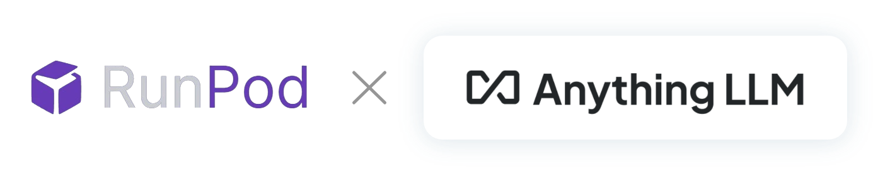

<a name="readme-top"></a>

[![Contributors][contributors-shield]][contributors-url]
[![Forks][forks-shield]][forks-url]
[![Stargazers][stars-shield]][stars-url]
[![Issues][issues-shield]][issues-url]
[![MIT License][license-shield]][license-url]
[![LinkedIn][linkedin-shield]][linkedin-url]

<!-- PROJECT LOGO -->
<br />
<div align="center">
  <a href="https://github.com/kovarjan/runpod-ollama-anything-llm/blob/master/README.md">
    
    
  </a>

  <h3 align="center">Run Anything LLM with Ollama in Runpod cloud - Docker Image</h3>

  <p align="center">
    runpod-ollama-anything-llm Docker image for running Anything LLM in Runpod cloud with Ollama as a LLM model runner.
    To run private LLM chat with documents in Runpod cloud with own documents and web UI.
    <br />
    <a href="https://hub.docker.com/r/kovarjan/runpod-ollama-anything-llm"><strong>View on DockerHub »</strong></a>
    <br />
    <br />
    <a href="https://github.com/kovarjan/runpod-ollama-anything-llm">Fork Project</a>
    ·
    <a href="https://github.com/kovarjan/runpod-ollama-anything-llm/issues/new?labels=bug&template=bug-report---.md">Report Bug</a>
  </p>
</div>

<!-- TABLE OF CONTENTS -->
<details>
  <summary>Table of Contents</summary>
  <ol>
    <li>
      <a href="#about-the-project">About The Project</a>
      <ul>
        <li><a href="#built-with">Built With</a></li>
      </ul>
    </li>
    <li><a href="#getting-started">Getting Started</a></li>
    <li><a href="#usage">Usage</a></li>
    <li><a href="#documentation">Documentation</a></li>
    <li><a href="#license">License</a></li>
    <li><a href="#contact">Contact</a></li>
  </ol>
</details>


<!-- ABOUT THE PROJECT -->
## About The Project

### Built With
[![Docker][Docker.dev]][Docker-url]

This is a docker image for running Anything LLM in Runpod cloud with Ollama as a LLM model runner. It is a all in one package to run private LLM models in Runpod cloud with own documents and web UI. It is based on the official mintplexlabs/anythingllm image with added Ollama model runner and runpod specific modifications.

<!-- GETTING STARTED -->
## Getting Started

To run image in Runpod cloud, you need to have a Runpod account. You can create an account [here](https://runpod.io/).
- Create runpod GPU pod template from this repository
    - set Volume Mount Path to "/app/server/storage"
    - and add environment variable "STORAGE_DIR" with value: "/app/server/storage"
    - expose port HTTP 3001 to connect to web UI
- Create a new pod from the template
- Start the pod and connect to it via SSH
- Run the command "ollama pull [any model name]" to download the model to ollama
- Connect to the pod and open the web UI in the browser
- Go threw the setup and set ollama as LLM runner and select the model you downloaded  
(ollama url: http://127.0.0.1:11434)  


![Runpod Template][template-screenshot]

<!-- USAGE EXAMPLES -->
## Usage

To use the image, you need to run it in Runpod cloud. You can use the image to run private LLM models in Runpod cloud with own documents and web UI. It is based on the official mintplexlabs/anythingllm image with added Ollama model runner and runpod specific modifications.

### Example supported LLM models
- Mistral
- Llama3
- Llama2
- Falcon
- And other models supported by Ollama https://ollama.com/library

#### Example:
```bash
ollama pull llama3
```

<!-- DOCUMENTATION -->
## Documentation

- Anything LLM: https://docs.useanything.com/  
- Ollama: https://ollama.com/  
- Runpod.io: https://runpod.io/  

<!-- LICENSE -->
## License

Distributed under the MIT License. See `LICENSE` for more information.

<!-- CONTACT -->
## Contact

Jan Kovar - [LinkedIn](https://www.linkedin.com/in/jan-kov%C3%A1%C5%99-133b7217a/) - [GitHub](https://github.com/kovarjan)


<!-- MARKDOWN LINKS & IMAGES -->
[contributors-shield]: https://img.shields.io/github/contributors/kovarjan/runpod-ollama-anything-llm.svg?style=for-the-badge
[contributors-url]: https://github.com/kovarjan/runpod-ollama-anything-llm/graphs/contributors
[forks-shield]: https://img.shields.io/github/forks/kovarjan/runpod-ollama-anything-llm.svg?style=for-the-badge
[forks-url]: https://github.com/kovarjan/runpod-ollama-anything-llm/network/members
[stars-shield]: https://img.shields.io/github/stars/kovarjan/runpod-ollama-anything-llm.svg?style=for-the-badge
[stars-url]: https://github.com/kovarjan/runpod-ollama-anything-llm/stargazers
[issues-shield]: https://img.shields.io/github/issues/kovarjan/runpod-ollama-anything-llm.svg?style=for-the-badge
[issues-url]: https://github.com/kovarjan/runpod-ollama-anything-llm/issues
[license-shield]: https://img.shields.io/github/license/kovarjan/runpod-ollama-anything-llm.svg?style=for-the-badge
[license-url]: https://github.com/kovarjan/runpod-ollama-anything-llm/blob/master/LICENSE.txt
[linkedin-shield]: https://img.shields.io/badge/-LinkedIn-black.svg?style=for-the-badge&logo=linkedin&colorB=555
[linkedin-url]: https://www.linkedin.com/in/jan-kov%C3%A1%C5%99-133b7217a/
[Docker.dev]: https://img.shields.io/badge/Docker-20232A?style=for-the-badge&logo=docker&logoColor=2496ED
[Docker-url]: https://www.docker.com/
[template-screenshot]: docs/images/RunpodTemplate.png
[project-logo]: docs/images/ProjectLogo.png
